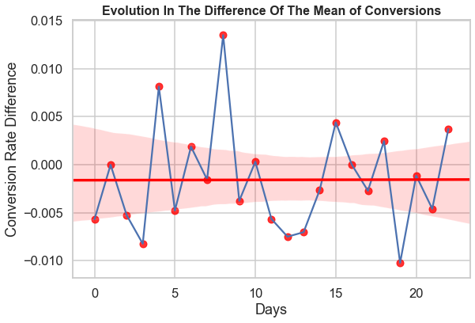
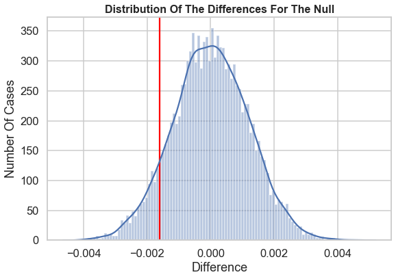
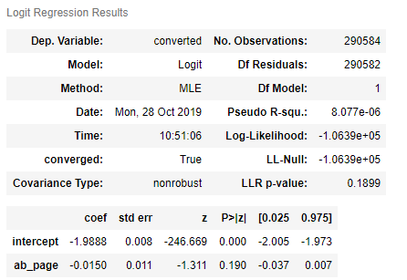
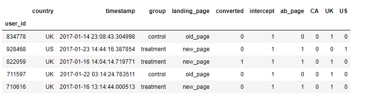
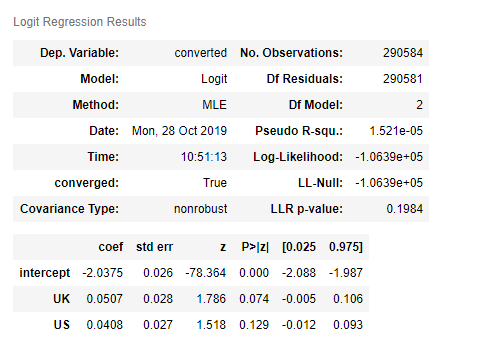
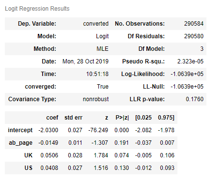
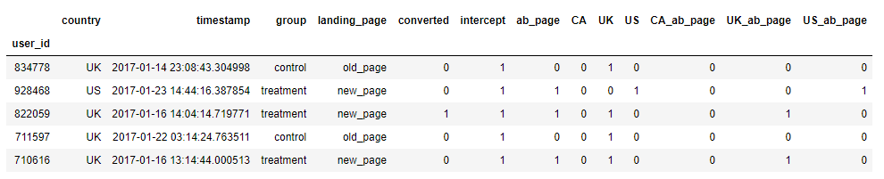
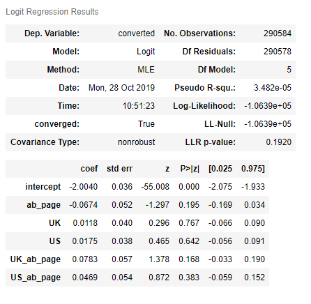

# Udacity Project: Analyze A/B Test Results

## Nanodegree: Data Analyst

## Title: Analyze A/B Test Results

### Table of Contents

<li><a href="#objective">Objective</a></li>
<li><a href="#data_description">Data Description</a></li>
<li><a href="#data_wrangling">Data Wrangling</a></li>
<li><a href="#part_1">Part I - Probability</a></li>
<li><a href="#part_2">Part II - A/B Test</a></li>
<li><a href="#part_3">Part III - A regression approach</a></li>
<li><a href="#conclusions">Conclusions</a></li>

## Objective

A/B tests are very commonly performed by data analysts and data scientists. The aim of this project is that we get some practice working with the difficulties of these.

We have been working to understand the results of an A/B test run by an e-commerce website. The company has developed a new web page in order to try and increase the number of users who "convert," meaning the number of users who decide to pay for the company's product. Our goal is to work through this notebook to help the company understand if they should implement this new page, keep the old page, or perhaps run the experiment longer to make their decision.

## Data Description:

We have worked with a single csv file with five colums:

* **user_id:** (Integer) A number that identifies each user.
* **timestamp:** (String) Time and date of each register.
* **group:** (String) Categorical variable with two values: `control` and `treatment`.
* **landing_page:** (String) Categorical variable with two values: `old_page` and `new_page`.
* **converted:** (Integer) Boolean variable with the values `0` (Not converted) and `1` (Converted).

The users are devided in two groups: `control` and `treatment`. The `new_page` is showed to the `treatment` group and the `old_page` is showed to the `control` group. The objective is to analyze the different behaviour of the two groups regarding the proportion of conversions.

## Data Wrangling

* The `treatment` group should be aligned with `new_page` and the  `control` group should be aligned with `old_page`, but there were 3893 rows that didn't meet this specification. We have proceeded to delte them.

* We have search also for missing values, but it was not necessary to do anything in this sense.

We have saved the result in the dataframe `df`.

The proccess followed in this work was guided by the Udacity requirementes expecified in the Notebook. Normally, we were asked a number of questions that we needed to answer. This makes difficult to do a summary. We are going to expose all the questions we were asked with the correspondent answeres and results of the analysis without entering in the code part. To see this take a look to the notebook of the project.

## Part I - Probability

In this part we were proposed to answer some questions about the dataset.

* Use df2 and the cells below to answer questions for Quiz3 in the classroom.

    a. How many unique user_ids are in df2? **290584**
    
    b. There is one user_id repeated in df2. What is it? **773192**
    
    c. What is the row information for the repeat user_id?
    
    
| user_id | timestamp                  | group     | landing_page | converted |
|--------:|----------------------------|-----------|--------------|-----------|
| 773192  | 2017-01-09 05:37:58.781806 | treatment | new_page     | 0         |
| 773192  | 2017-01-14 02:55:59.590927 | treatment | new_page     | 0         |

    d. Remove one of the rows with a duplicate user_id.
    
* Use `df2` in the below cells to answer the quiz questions related to Quiz 4 in the classroom.

    a. What is the probability of an individual converting regardless of the page they receive? **0.1196**
    
    b. Given that an individual was in the control group, what is the probability they converted? **0.1203863045004612**
    
    c. Given that an individual was in the treatment group, what is the probability they converted? **0.11880806551510564**
    
    d. What is the probability that an individual received the new page? **0.5001**
    
    e. Consider your results from a. through d. above, and explain below whether you think there is sufficient evidence to say        that the new treatment page leads to more conversions.
    
The difference between the converted rates for new and old pages is very small. Just a 0.16%. According the data     observed there is no significative evidence that justify the cost of changing the page.
       

## Part II - A/B Test   

In this part we are invited to reflect on the following consideration:
    
>Notice that because of the time stamp associated with each event, you could technically run a hypothesis test continuously as each observation was observed. However, then the hard question is do you stop as soon as one page is considered significantly better than another or does it need to happen consistently for a certain amount of time? How long do you run to render a decision that neither page is better than another? These questions are the difficult parts associated with A/B tests in general.   1. For now, consider you need to make the decision just based on all the data provided. If you want to assume that the old page is better unless the new page proves to be definitely better at a Type I error rate of 5%, what should your null and alternative hypotheses be? You can state your hypothesis in terms of words or in terms of  𝑝𝑜𝑙𝑑  and  𝑝𝑛𝑒𝑤 , which are the converted rates for the old and new pages.

One alternative is to evaluate the difference between the converted rates: *pnew - pold.*

If it is negative or equal to 0 it means that the old page would be a better option. This will be the null hypothesis (H0). Otherwise, we should choose the new page, this would be the alternative hypothesis (H1)

$$H_0: p_{new} - p_{old} \leq 0$$

$$H_1: p_{new} - p_{old} > 0$$

To decide wether the time of observation is enough or not it can be helpful to check how many days the test has been running and if there has been an evolution along these days. We have checked that the data has been stored for 23 days.

We have also prepared a visualization of the evolution of the conversions along these days. If we could see a clear increment, we could consider to mantein the test some more days.

We have drawn a plot with the difference between the mean of conversions in the treatment group and the control group. We also have drawn a trend line to observe the evolution, but we don't see any clear trend. Instead of that, the results seem to follow an horizontal line.

Maybe we can leave the test more time anyway to see if the people change their behavior, but so far the results are quite stable. These sesults tend also to be negative, which means that there is a bigger rate of conversión in the control group.

>`2.` Assume under the null hypothesis, $p_{new}$ and $p_{old}$ both have "true" success rates equal to the **converted** success rate regardless of page - that is $p_{new}$ and $p_{old}$ are equal. Furthermore, assume they are equal to the **converted** rate in **ab_data.csv** regardless of the page.    Use a sample size for each page equal to the ones in **ab_data.csv**.     Perform the sampling distribution for the difference in **converted** between the two pages over 10,000 iterations of calculating an estimate from the null.    

a. What is the **convert rate** for $p_{new}$ under the null?  **0.1196**

b. What is the **convert rate** for $p_{old}$ under the null? **0.1196**

c. What is $n_{new}$? **145310**

d. What is $n_{old}$? **145274**

e. Simulate $n_{new}$ transactions with a convert rate of $p_{new}$ under the null.  Store these $n_{new}$ 1's and 0's in **new_page_converted**.

We have used the function np.random.binomial with p = $p_{new}$ and the number of samples equal to $n_{new}$.

f. Simulate $n_{old}$ transactions with a convert rate of $p_{old}$ under the null.  Store these $n_{old}$ 1's and 0's in **old_page_converted**.

We have applied the same procedure with p = $p_{old}$ and the number of samples equal to $n_{old}$.

g. Find $p_{new}$ - $p_{old}$ for your simulated values from part (e) and (f). **0.00036270219122583325**

h. Simulate 10,000 $p_{new}$ - $p_{old}$ values using this same process similarly to the one you calculated in parts **a. through g.** above.  Store all 10,000 values in a numpy array called **p_diffs**.

We have made a loop with 10.000 iterations. The resutl was a list **p_diffs** with 10.000 values.

We have used also other alternatives like using the function np.random.choice or use the function binomial with 10.000 repetitions instead of doing a loop. We have obtained similar results.

>i. Plot a histogram of the **p_diffs**.  Does this plot look like what you expected?  

We can see in the picture below the distribution of these values. We have also drawed a red line with the difference observed in the dataframe `df2`.

The histogram shape was as we expected. We have drawn 10000 simulated datasets for each group. We have suposed that
each dataset follows a binomial distribution, which can be aproximated by a normal distribution according the high number of samples for each dataset. The mean used to compute the binomial is the same for all datasets and it is equal to the mean observed in the original dataframe regardless the page.

In each one of the 10000 tests we have calculated the difference in the mean for both simulated dataset, treatment and control.

Then we have drawn all the differences in an histogram. The result is a bell or gaussian shape distribution centered in 0. We have also draw a red line with the position of the difference of the means observed in the original dataset to have a graphic view of the proportions that are bigger and smaller than this value. 

The result was as we expected.

> j. What proportion of the **p_diffs** are greater than the actual difference observed in **ab_data.csv**?

This proportion is about 0.907 (90.7%)

> k. In words, explain what you just computed in part **j.**  What is this value called in scientific studies?  What does this value mean in terms of whether or not there is a difference between the new and old pages?

We have calculated the p-value for the hypothesis test H0 explained in the point one. We have simulated an scenario repeteadly for 10000 times in which the H0 hypothesis is true. Expeciphically we have situated our simulated tests in the limit between H0 and H1, where the difference is equal to 0. Then we have calculated the proportion of results from this tests that are closer to the H1 than the actual result extracted from the original data set. In our case it means than the proportion of results that are greater than the real difference of the means is 90.07%.

> l. We could also use a built-in to achieve similar results.  Though using the built-in might be easier to code, the above portions are a walkthrough of the ideas that are critical to correctly thinking about statistical significance. Fill in the below to calculate the number of conversions for each page, as well as the number of individuals who received each page. Let `n_old` and `n_new` refer the the number of rows associated with the old page and new pages, respectively.

* convert_old: 17489
* convert_new: 17264 
* n_old: 145274
* n_new: 145310

>m. Now use stats.proportions_ztest to compute your test statistic and p-value. Here is a helpful link on using the built in.

We have obtained the following values for the z-score and the p-value:

* z-score: -1.3109241984234394 
* p-value: 0.9050583127590245

> n. What do the z-score and p-value you computed in the previous question mean for the conversion rates of the old and new pages?  Do they agree with the findings in parts **j.** and **k.**?

In this case we have analyzed the same problem as before but from another point of view. Instead of drawing an estimation of the distribution for the difference of the means according the null hypothesis, we estimate the z-score distribution for the difference of the means of the two groups.

We have supposed that the data set is normally distibuted and the samples are independent in both methods. The distribution of the z-score will be also normally distributed.

Then, the function proportions_ztest calulates the the two samples z-score for the two groups. This value is saved in the stat variable in our code.

The z-score measures how far the difference is from the null hypothesis. It measures how far, in Standar Errors, our difference is from the expected hypothesis null (null limit: the difference is equal to zero).

$$ z= {\text{Observed difference - Expected difference} \over \text{SE for difference}}$$

$$ z= {{(\bar{X_1}-\bar{X_2})-(\mu_1-\mu_2)} \over {\sqrt{\sigma_\bar{X_1}^2+\sigma_\bar{X_2}^2}}}$$

$$\text{Where: }(\mu_1-\mu_2) = 0 \text{  , because we are suposing the null hypothesis.}$$

$$z={{(\bar{X_1}-\bar{X_2})} \over {\sqrt{{\sigma_1^2}/n_1+{\sigma_2^2}/n_2}}}$$

This formulas have been extracted from:http://www.stat.ucla.edu/~cochran/stat10/winter/lectures/lect21.html

Finally the value saved in pval tell us the proportion of z-scores greater than the value saved in stat in the z-score distribution. In this case is greater because we have selected altenative="larger" and we have done that because we have decided that our hypthesis are:

$$H_0: \mu_{new} - \mu_{old} \leq 0$$

$$H_1: \mu_{new} - \mu_{old} > 0$$

This method is faster because we only have to calculate the z-score. Then, as the z-score distribution is a gaussian function, the calculation of the proportion of values greater than z-score is very quick and easy with a computer.

## Part III - A regression approach

>`1.` In this final part, you will see that the result you acheived in the previous A/B test can also be acheived by performing regression.  a. Since each row is either a conversion or no conversion, what type of regression should you be performing in this case?

Taking into account that the response variable is categorical, it should be performed a logistic regression.

> b. The goal is to use **statsmodels** to fit the regression model you specified in part **a.** to see if there is a significant difference in conversion based on which page a customer receives.  However, you first need to create a column for the intercept, and create a dummy variable column for which page each user received.  Add an **intercept** column, as well as an **ab_page** column, which is 1 when an individual receives the **treatment** and 0 if **control**.

We have done it as specified.

>c. Use statsmodels to import your regression model. Instantiate the model, and fit the model using the two columns you created in part b. to predict whether or not an individual converts.

    '''
    #It instantiates the model: response variable:"converted"; predictors:"intercept", "ab_page"
    logit_mod = sm.Logit(df2['converted'], df2[['intercept', 'ab_page']])
    #Fit the model.
    results = logit_mod.fit()
    '''

> d. Provide the summary of your model below, and use it as necessary to answer the following questions.

If we apply the exponential to the sum of the coeffiecients and we extract the proportion from the logit:

    '''
    #it calculates the probability of converted = True for the new page.
    exp_logit = np.exp(results.params.values[0] + results.params.values[1])
    p_converted = exp_logit / (1 + exp_logit)
    '''
    
The probability of converted = True if ab_page = new_page if we don't take into account other predicor variables. It is the same value that we had obtained from the original dataframe df2.

**p_converted: 0.11880806551510481**

The probability of converted = True if ab_page = old_page if we don't take into account other predicor variables.It is also the same value that we had obtained from the original dataframe df2.

**p_converted: 0.1203863045004608**

>e. What is the p-value associated with **ab_page**? Why does it differ from the value you found in **Part II**?    **Hint**: What are the null and alternative hypotheses associated with your regression model, and how do they compare to the null and alternative hypotheses in the **Part II**?

In this case the p-value measures the statistical significance of the coefficient asociated with the ab_page column. It gives us an idea of how relevant is the statistical significance for the relationship between the variable response and the page of the group. In this case the null and alternative hypothesis are different from the hypothesis in Part II:

$$H_0: \beta_1 = 0$$

$$H_1: \beta_1 \neq 0$$

The p-value is different here because, according the hypothesis, we are considering a two sided case. If we had excuted the function proportions_ztest with alternative='two_sided', the results would have been the same. 

We can adapt this p-value to the two_sided hypotesis test doing this also:

**1-results.pvalues[1]/2 = 0.905056894381869**

We have also seen that the z-value for the coeficient of ab_page is the same as we had calculted with the function proportions_ztest (-1.31). This is because the z-score is the point of intersection between the two hypothesis, and in both cases the intersection is the same, so it is logical that we have the same value.

> f. Now, you are considering other things that might influence whether or not an individual converts.  Discuss why it is a good idea to consider other factors to add into your regression model.  Are there any disadvantages to adding additional terms into your regression model?

As we have seen in the summary, the p-value is equal to 0.19. This means that is too large (more than 0.05) and **we must fail to reject the null hypothisis. So we must consider so far, H0 as true because we don't have statitical evidence that the probability of convesion depends on the page.**

It is a good idea to consider other variables for searching for a better fit of the model. We could find new variables or combinations of variables that could explain better the variable response. Maybe if we divide the groups of test in amaller groups or market divisions, some of these groups could prefer the new page to the old one.

One of the most important problems that we can find is the collinearity between the predictor variables. In this case the confidence interval for the p-value of the coefficients can be very large and makes the method not useful. Because of this we always have to leave one of the dummy variables out for each predictor.

Another problem is that the results are a little more dificoult to interpretate.

> g. Now along with testing if the conversion rate changes for different pages, also add an effect based on which country a user lives. You will need to read in the **countries.csv** dataset and merge together your datasets on the approporiate rows.  [Here](https://pandas.pydata.org/pandas-docs/stable/generated/pandas.DataFrame.join.html) are the docs for joining tables.   Does it appear that country had an impact on conversion?  Don't forget to create dummy variables for these country columns - **Hint: You will need two columns for the three dummy variables.** Provide the statistical output as well as a written response to answer this question.

* We have don as indicated and we have calculated also the VIF's only to check that there is not collinearity between the predictor columns.

We haven't detected VIF values that we must to concern about.

* We have applyed again the Logit model from statsmodels using Canada as the intercept and without having into consideration the page:

      logit_mod = sm.Logit(df_new['converted'], df_new[['intercept', 'UK' , 'US']])
      results = logit_mod.fit()
      results.summary()

      np.exp(results.params.values)
      array([0.13035004, 1.05202749, 1.04164685])

The exponentials of the coefficients for UK and US are a bit bigger than one, so the probability for converted will be bigger than in Canada, without taking into account the page. Anyway, the p-value for these coefficients (0.074 and 0.129) are out of range to give them statistical significance.

* Now we have repeated the same procedure but including the page in the model.

       np.exp(results.params.values)
       array([0.13133178, 0.98516771, 1.05194441, 1.04159895])
       
       
The p-values continues to be bigger than 0.05 in all the cases. Which means that there is not enough statistical significance for the coeffiecients obtained. Anyway we can try to extract some conclusions.

The first exponential (the exponential of the intercept) gives us the value of the logit of odds for the probability of conversion when the country is equal to Canada and the the page is the old page. The value obtained is close to the probabilities obtained so far.

The exponential of the ab_page coefficient indicates us that the logit for the new page is 0.98 smaller, regardless the other predictors. The third and fourth exponentials tell us that the logit for UK and US are 1.05 and 1.04 greater, regardless the other predictors.

It is not easy to extract some new conclusions from hear. Only that Canada has a rate of conversion smaller than the other countries, for the old page and the new page, and that the new page has also a smaller rate than the old page without taking into account the countries.    

>h. Though you have now looked at the individual factors of country and page on conversion, we would now like to look at an interaction between page and country to see if there significant effects on conversion.  Create the necessary additional columns, and fit the new model.   Provide the summary results, and your conclusions based on the results.

We have added three new columns in which we combine the values from the ab_page and the country columns:

     df_new['CA_ab_page'] = df_new['CA'] * df_new['ab_page']
     df_new['UK_ab_page'] = df_new['UK'] * df_new['ab_page']
     df_new['US_ab_page'] = df_new['US'] * df_new['ab_page']
     

After applying the model again we have obtained the next results:

      exp_values = np.exp(results.params.values)
      array([0.13479426, 0.9347762 , 1.01185353, 1.01768233, 1.08142797,
       1.04800102])

Again, the p-values are too large to stablish a clear linear relationship between the logit and the predictors. But have analized the coefficients again to understand their meaning.

* The exponential of the intercept has the same meaning as in the previous case. It is the value of the odds for Canada and old_page.

* The exponential of the ab_page coefficient tells us that the logit is **0.93 smaller for new pages**. So the odd for Canada and new_page is 0.93 samaller than for old_page, which means that there are less conversions in the new page in Canada.

* The exponential for UK and US tell us that this countries has, for old pages, a slightly bigger rate of conversion than Canada in the old page: **1.012 and 1.0177 bigger.**

* Two know the behavior in the new page we have to consider in each case all the conditions that are true. For example, for US and new_page the last exponential tell us that we have to multiply by 1.048, but, because we are considering the new page we have to multiply also for 0.935. An for beeing US we have to multiply by 1.017.

* As a summary, we have seen that **the only country that has a bigger rate of conversions in the new page than in the old page is the UK.** This country is the only one who has a greater odd in the new page. Especifically it has a 0.001114 (0.1%) more conversions in the new page than in the old page. While Canada has 0.00688 (0.688%) less conversions and US 0.00216 (0.216%) less conversions.

Finally, We wold like to do also the hypothesis test separately for each country, because we have seen that UK have had a slightly different behavior than the other two countries. Maybe it could exsist the posibility of using different pages for each coutry. If we can reject the null hypothesis for UK, we could use the new page there and the old one in US and Canada.

## Conclusions

**1. The most important conclusion is that we failed to reject the null hypothesis in all the cases. We can not consider that the new page suppose an increment in the rate of conversions.**

**2. The p-values are always bigger than the threshold 0.05, which would give us a confidence interval of 95%. This makes that we can not reject the null hypothesis in the hypothesis test methods and that the logistic regression does not give us accurate predictions. This is normal because the percentage of conversions is very similar in all the countries and in both pages.**  

**3. Anyway, if we do not take into account the p-values obtained in the logistic regressions, we can extract the conclusion that the behavior has not been the same in all the coutries:**

* **Canada has had the lowest rates of conversions, both in the old page and in the new page. And the new page has suffered here the biggest decrement in the conversions, 0.688% less than in the old page.**

* **The US has suffered the second biggest decrement, 0.216% less conversions in the new page than in the old page. But it seems that the rates of conversions are bigger than in Canada in both pages.**

* **Finally The UK is the only country that has had an increment in the conversions, very small but an increment. The conversions in the new page have been 0.1% greater than in the old page. Anyway the increment is so small and the p-value that we have obtained in the last point for the hypothesis test, 0.93, recommends that we not reject the null hypothesis in this case either.**

